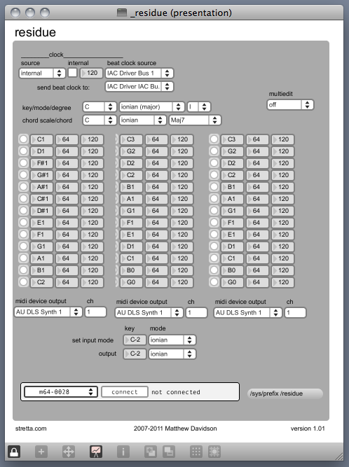

# residue

written by stretta

residue is an outgrowth of TR-256. It still has the drum sequencer, but there are two 'melodic' step sequencers as well for a total of three 'parts'

The top row determines which pattern(s) are playing

The second row determines which pattern you are editing. Holding down a button while editing edits all patterns of that part. So, you can enter in a kick drum pattern for all patterns at once, for example. When you switch to edit the next pattern, the kick drum is already in place. 

The third row is the pattern length of the currently edited pattern. 

The remaining rows contain pattern data. 

http://vimeo.com/398616